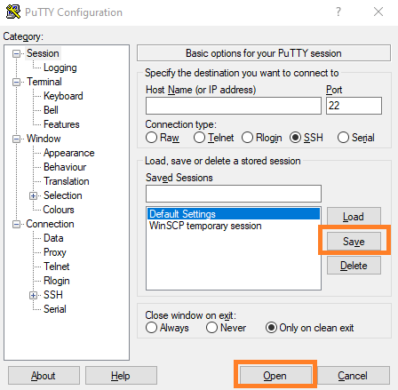
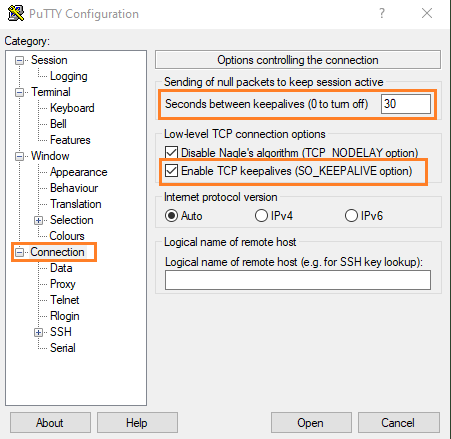

# Helper for remote tools (putty, mRemoteNG, etc...)

mRemoteNG is a great tool to open putty/ssh connection in tabs, get it here: <https://mremoteng.org/download>

## Tip 1: Configuration inheritance Folder/Connections

>Understand how to use inheritance to use credentials in folder scope, and your putty connections will reuse them: <https://mremoteng.readthedocs.io/en/latest/folders_and_inheritance.html>

## Tip : Add keepalive in putty

Having sometimes multiple ssh connections openned, you probably lost your connection because of going idle...  
So this is a `Game Changer tip`!  
You need to be sure to modify the Default Settings to make it available for all your connections, see screenshot

And here your can set the interval in seconds for the activated keepalive 

Don't forget to save and verify by relaunching your putty.exe, and voilà!
