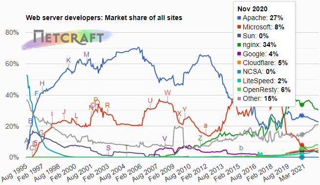

# Securité des Applications Web

## Arabe

* Haram: Mauvais
* Hallal: opposé de Bien 
* Khallas: Terminé
* Abadan: Jamais

## Importantes règles

* La faiblesse des uns fait la force des autres
* Connaître les attaques qui existent (type, outils et commandes qui permettent de les executer), permet de mieux se défendre
* La confiance, n'exclu pas la vérification; exemple une personne de ta famille te donne de l'argent, mais tu recompte à part :)
* Le niveau de sécurité élevé, implique une baisse des performances
* Le principe du "moindre privilège" chaque personne/composant doit avoir uniquement les privilèges nécessaires pour exercer son activité
* Raisonner avec un niveau d'abstraction élevé pour mieux décliner la sécurité au cas particuliers

### Astuces

Commande pour passer en clavier azerty français dans la session

> setxkbmap fr

ou bien modifier le fichier

>cat /etc/default/keyboard

```ini
XKBLAYOUT="fr"
```

## Cas de risques

* Sollicitations non sécurisées (armée utilisation de gmail)
* Contenu des informations critique (l'information n'est pas adaptée au destinataire)
* Faire des logs protégés pour détecter les attaques, éviter que les attaquants puissent les lires, modifier, supprimer
* Mixe entre manque de compléxité vs investiguation: un gamin qui 'hack' le compte d'Obama, car le mdp était le nom de son chien...

## HTTPS

"HTTPS over TLS" (version courante 1.3), pour chiffrer de bout en bout les données.  
Exemple: On ne sait pas si les données sont stokées en clair, et quelle machine sur le réseau peut lire. Les données chez l'hébergeurs ne sont pas à l'abris de subir une attaque de leur base de données (yahoo en 2010, 500M d'utilisateurs)

## ANSI

<https://www.cert.ssi.gouv.fr/>  
vols de cookies  
<https://www.cert.ssi.gouv.fr/cti/CERTFR-2022-CTI-005/>

## Netcraft

Site, non commercial, pour référencer les niveau de sécurité etc...



## Outils, astuces

### Antivirus

Vérifier par 3 antivirus minimum avant d'installer, sinon c'est ('harass' une faute professionnelle

[Virus Total](https://www.virustotal.com/gui/home/upload) Pour faire vérifier par plusieurs antivirus des fichiers xpi, exe, pdf, etc...  
Exemple pour récupérer le fichier de l'extension d'un browser (xpi ou autre)  

Manière simple: croiser les navigateur pour aller récupérer le fichier de l'extention au lieu de l'installer
Manière moins simple: aller en ftp, ou changer le type de fichier dans l'entête HTTP pour récupérer le fichier

### Verification Server

* [SSL Labs](https://www.ssllabs.com/ssltest/analyze.html) : Tester un site
* [Security Headers](https://securityheaders.com) : Audit des en-têtes

Exemple à tester avec www.ipc.com 

### Utilitaire protocoles

* [SCAPY](https://github.com/secdev/scapy) terminal python pour manipuler des protocoles facilement
* Chrome ou Firefox : http_header_live pour lire les échanges de requêtes  
exemple <http://www.google.fr> (on observe qu'il redirige sur https, qu'il propose du HTTP/2, ...)
* [Google Hacking Database](https://www.exploit-db.com/google-hacking-database) exemple intext: "index+of" film

## Protocoles

HTTP/3 & [QUIC](https://en.wikipedia.org/wiki/QUIC)  
Optimisation qui intègre TLS pour remplacer TCP : QUIC est utilisé par Zoom, Teams, ...

SFTP = FTP over SSH
FTPS = FTP over TLS

## Organisations, Groupes de Travail

[IEEE](https://www.ieee.org/): couche basses
* 802.1
* 802.2
* 802.3
* 802.11 : Wifi est une association pour faire de la promotion du 802.11

[IFIP](https://networking.ifip.org/)
* 6.5

[IETF](https://www.ietf.org/)
* WG

## Attaques

### Couches basses

#### TCP SYN Flooding

TCP complèxe et vulnérables à certaines attaques; TCP est géré par le noyau de l'OS  
[SYN flood](https://en.wikipedia.org/wiki/SYN_flood)  
Pour se défendre: Firewall, [SYN cookie](https://en.wikipedia.org/wiki/SYN_cookie)  
Intgré dans le noyau Linux, et activée par défaut,  
Sous windows, le fichier est à créer il n'existe pas par défaut.

```shell
cat /proc/sys/net/ipv4/tcp_syncookies  
1
```

exemple d'attaque sur le site d'orsys :)

>hping3 --flood --syn --rand-source -p 80 ww.orsys.fr

```shell
arp -a
? (192.168.3.15) at 00:0c:29:7e:0c:86 [ether] on eth0
? (192.168.3.101) at 00:0c:29:39:89:04 [ether] on eth0
? (192.168.3.11) at 00:19:99:f2:cf:e1 [ether] on eth0
? (192.168.3.7) at 00:19:99:f2:7c:e4 [ether] on eth0
? (192.168.3.20) at 00:0c:29:aa:c6:04 [ether] on eth0
? (192.168.3.3) at 00:19:99:f2:34:6c [ether] on eth0
? (192.168.3.100) at 00:19:99:f2:34:63 [ether] on eth0
? (192.168.3.150) at 00:0c:29:3d:b6:49 [ether] on eth0
? (192.168.3.14) at 00:19:99:f2:d0:30 [ether] on eth0
? (192.168.3.6) at 00:19:99:f2:34:9e [ether] on eth0
? (192.168.3.212) at 00:0c:29:00:96:62 [ether] on eth0
? (192.168.3.13) at 00:19:99:f2:d0:42 [ether] on eth0
? (192.168.3.254) at 00:00:cd:33:9d:af [ether] on eth0
? (192.168.3.5) at 00:19:99:f2:34:ba [ether] on eth0
? (192.168.3.60) at 00:0c:29:5c:10:0b [ether] on eth0
? (192.168.3.110) at 00:0c:29:2d:14:87 [ether] on eth0
? (192.168.3.4) at 00:19:99:f2:34:5c [ether] on eth0
? (192.168.3.105) at 00:0c:29:c8:76:ca [ether] on eth0
```

### Couches hautes

#### En-tête HTML

Modification du contenu de l'en-tête pour tromper le destinataire

##### User-Agent

Une de plus redoutable depuis ces 30 dernières années


##### Cookies

[Google Scholar](https://scholar.google.com/scholar?hl=fr&as_sdt=0%2C5&q=attacks+cookies&oq=) permet d'aller chercher des synthèses d'études, exemple : [Protecting cookies from Cross Site Script attacks using Dynamic Cookies Rewriting technique](https://ieeexplore.ieee.org/abstract/document/5745998)


## Travaux Pratique

commande pour créer une connexion TLS avec un seerveur

```shell
OpenSSL> s_client -tls1_3 -host www.google.fr -port 443
CONNECTED(00000003)
depth=2 C = US, O = Google Trust Services LLC, CN = GTS Root R1
verify return:1
depth=1 C = US, O = Google Trust Services LLC, CN = GTS CA 1C3
verify return:1
depth=0 CN = *.google.fr
verify return:1
---
Certificate chain
 0 s:CN = *.google.fr
   i:C = US, O = Google Trust Services LLC, CN = GTS CA 1C3
 1 s:C = US, O = Google Trust Services LLC, CN = GTS CA 1C3
   i:C = US, O = Google Trust Services LLC, CN = GTS Root R1
 2 s:C = US, O = Google Trust Services LLC, CN = GTS Root R1
   i:C = BE, O = GlobalSign nv-sa, OU = Root CA, CN = GlobalSign Root CA
---
Server certificate
-----BEGIN CERTIFICATE-----
MIIEjDCCA3SgAwIBAgIQULgn7NhryQQKVodeAbtwaDANBgkqhkiG9w0BAQsFADBG
MQswCQYDVQQGEwJVUzEiMCAGA1UEChMZR29vZ2xlIFRydXN0IFNlcnZpY2VzIExM
QzETMBEGA1UEAxMKR1RTIENBIDFDMzAeFw0yMjA3MDQwODI3MTJaFw0yMjA5MjYw
ODI3MTFaMBYxFDASBgNVBAMMCyouZ29vZ2xlLmZyMFkwEwYHKoZIzj0CAQYIKoZI
zj0DAQcDQgAE2khUM/y7PmTqHCQhuvzjvnmAbRSSy+dV9ptKBAi/EgyijqHzV/Dd
VtwlxYw3pzCVXk/9nLd28CbQ5V38ZpJU06OCAm8wggJrMA4GA1UdDwEB/wQEAwIH
gDATBgNVHSUEDDAKBggrBgEFBQcDATAMBgNVHRMBAf8EAjAAMB0GA1UdDgQWBBRd
9DMS5Szj8Ll+hYCObTxQwbcV2zAfBgNVHSMEGDAWgBSKdH+vhc3ulc09nNDiRhTz
cTUdJzBqBggrBgEFBQcBAQReMFwwJwYIKwYBBQUHMAGGG2h0dHA6Ly9vY3NwLnBr
aS5nb29nL2d0czFjMzAxBggrBgEFBQcwAoYlaHR0cDovL3BraS5nb29nL3JlcG8v
Y2VydHMvZ3RzMWMzLmRlcjAhBgNVHREEGjAYggsqLmdvb2dsZS5mcoIJZ29vZ2xl
LmZyMCEGA1UdIAQaMBgwCAYGZ4EMAQIBMAwGCisGAQQB1nkCBQMwPAYDVR0fBDUw
MzAxoC+gLYYraHR0cDovL2NybHMucGtpLmdvb2cvZ3RzMWMzL3pkQVR0MEV4X0Zr
LmNybDCCAQQGCisGAQQB1nkCBAIEgfUEgfIA8AB2ACl5vvCeOTkh8FZzn2Old+W+
V32cYAr4+U1dJlwlXceEAAABgciJCmQAAAQDAEcwRQIgdcqj/oqMzm73q31+mnBk
eLe8TvXoKSuy2L7x2B1E+C4CIQCVrp3e1O5VufU17T1NHm5PxaSFrJk2dhvdb3Yt
Z3B3lgB2AAWcAdMg4AeEE5WASY0RfJAyZq+vclC1rztGpD4RhA1KAAABgciJCpUA
AAQDAEcwRQIgFRrr6Olvp6ssCn9sA5qfMxBc94vMVCh0Q3PujRGDMgICIQDfYv9a
LMIP0dVhX0e7GWY7RhEWry7Q+SJ9VQISvqJ8eTANBgkqhkiG9w0BAQsFAAOCAQEA
s0PcspV4bjBffYbBJx4Ca9BX7fUg/VEW7fzB6IYXqobl8adzfuwHSC1g9IyeFX5c
XfFAn9yMlIVwvnz+u+2xSsMTSAFzMtgkk80iNKdndb+y6TVoYAJ8XTRLPYa6mT/u
RUzl466YtVzwbBbj/UUjo18PuKDTIa2PHNZuuGkDWREwnIihZNt3UhGTOAg2jHY+
/3Ik2q6HxgRklVt1iye88anT50VNfaCuvGXjmLWaw/cTtIMdKRSA/CQ5iASnRxFo
De15fQh8OihEyRxB/TOEAfUfDEk7Q7ohqnPwJGKRfb5Ynm1Pix8WP4X51hQdmBzB
U9zD7+cmwPgTHbVlNkF+Ww==
-----END CERTIFICATE-----
subject=CN = *.google.fr

issuer=C = US, O = Google Trust Services LLC, CN = GTS CA 1C3

---
No client certificate CA names sent
Peer signing digest: SHA256
Peer signature type: ECDSA
Server Temp Key: X25519, 253 bits
---
SSL handshake has read 4299 bytes and written 317 bytes
Verification: OK
---
New, TLSv1.3, Cipher is TLS_AES_256_GCM_SHA384
Server public key is 256 bit
Secure Renegotiation IS NOT supported
Compression: NONE
Expansion: NONE
No ALPN negotiated
Early data was not sent
Verify return code: 0 (ok)
---
read:errno=0    <<<<<< après un timeout la session est coupée
```

```
map -sS -sV -v -p 80,443 www.orsys.fr
whatweb -v https://www.orsys.fr
nikto -h https://www.orsys.fr

```


---

### Qestion

* Comment tester une configuration par défaut d'une application téléchargée, méthodes ou outils ?


